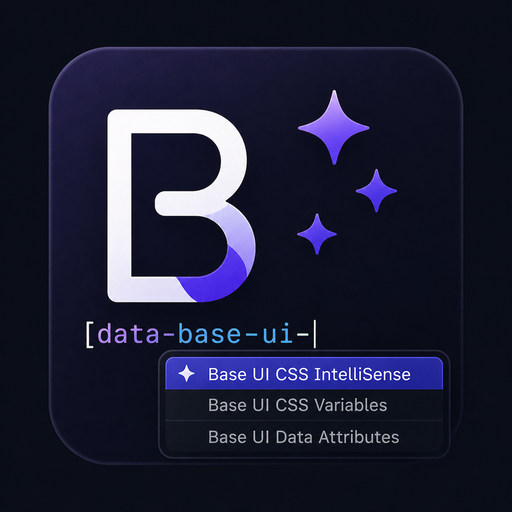

<p align="center">
  
  <h1 align="center">Base UI CSS IntelliSense</h1>
</p>

Autocomplete and hover documentation for [Base UI](https://base-ui.com) data attributes and CSS variables — directly in your CSS, SCSS, and Less files.

## What it does

When you write CSS attribute selectors or custom property values targeting Base UI components, this extension gives you completions and inline docs without leaving your editor. Type `[data-` to see all Base UI data attributes with descriptions, pick one, then get value completions for enumerated options like `top | bottom | left | right`. Hover any Base UI `--variable` or `[data-*]` selector to see which components use it and jump straight to the source on GitHub.

<!-- Record a GIF showing: attribute name completion, value completion, hover tooltip, and var() completion -->
<!-- Place the recording at assets/demo.gif and uncomment the lines below -->
<!-- ## Demo -->
<!--  -->

## Supported languages

CSS, SCSS, Less

## Base UI version

Currently ships data for **Base UI v1.4.1**.

To regenerate from a local clone of the Base UI repo:

```bash
pnpm generate <path-to-base-ui-repo>
```

## Contributing

Issues and PRs welcome at [github.com/IdoS350/base-ui-css-intellisense](https://github.com/IdoS350/base-ui-css-intellisense).

## Attribution

This extension bundles data derived from Base UI source code.
Base UI is copyright MUI and licensed under the MIT License — see [NOTICE](NOTICE).

## License

MIT — see [LICENSE](LICENSE).
