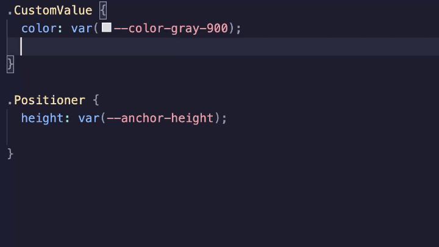

  
  <h1 align="center">Base UI CSS IntelliSense</h1>

Autocomplete and hover documentation for [Base UI](https://base-ui.com) data attributes and CSS variables — directly in your CSS, SCSS, and Less files.

Install from the [VS Code Marketplace](https://marketplace.visualstudio.com/items?itemName=idos.base-ui-css-intellisense).

## What it does

When you write CSS attribute selectors or custom property values targeting Base UI components, this extension gives you completions and inline docs without leaving your editor. Type `[data-` to see all Base UI data attributes with descriptions, pick one, then get value completions for enumerated options like `top | bottom | left | right`. Hover any Base UI `--variable` or `[data-*]` selector to see which components use it and jump straight to the source on GitHub.

## Supported languages

CSS, SCSS, Less

## Base UI version

The extension automatically detects which version of `@base-ui/react` is installed in your workspace and fetches the matching data from GitHub. The fetched data is cached locally so subsequent startups are instant and offline use still works.

If no data exists for your exact version, the extension falls back to its bundled dataset and logs a message to the **Base UI IntelliSense** output channel explaining which version is in use.

## Contributing

Issues and PRs welcome at [github.com/IdoS350/base-ui-css-intellisense](https://github.com/IdoS350/base-ui-css-intellisense).

## Attribution

This extension bundles data derived from Base UI source code.
Base UI is copyright MUI and licensed under the MIT License — see [NOTICE](NOTICE).

## License

MIT — see [LICENSE](LICENSE).
